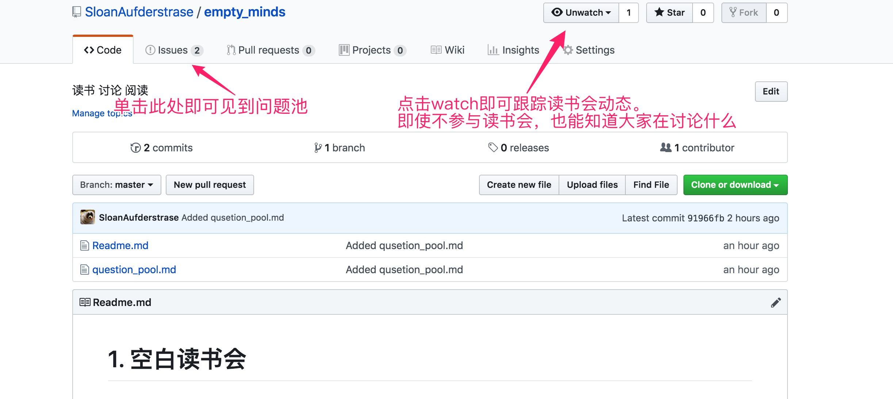
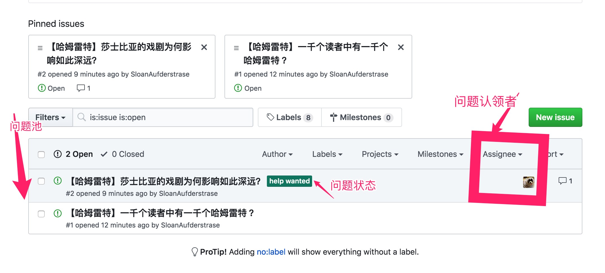
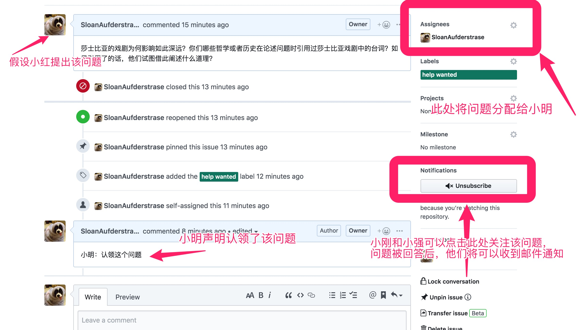

# 1. 问题池计划

<!-- TOC -->

- [1. 问题池计划](#1-问题池计划)
  - [1.1. 简介](#11-简介)
  - [1.2. 计划](#12-计划)
    - [1.2.1 步骤](#121-步骤)
    - [1.2.2 概念](#122-概念)
    - [1.2.3 问题池示例](#123-问题池示例)
  - [1.3优缺点](#13优缺点)

<!-- /TOC -->

---

## 1.1. 简介
为了读书会的健康发展，推出"**问题池**"计划。

---

## 1.2. 计划
>饮食男女，人之大欲。对我们平头老百姓来说，可以没有所谓“形而上”，但绝不能没有所谓“形而下”，因此，问题池计划虽然推崇攀登思想和认知的高山，但同时也不会排斥人们现实中的种种需求。
我们之中也许有单纯的“求索者”，有单纯的“求娱者”，但更多的是两者皆求。

* **求索** ：问题池计划的意义，在于鼓励和引导主动探索，反对被动灌输；鼓励自圆其说的独特观点，反对东捡西拾的人云亦云。

* **娱乐** ：我们也支持佛系参与，即我听，我看，我随性表达；众人按照各自兴趣，各取所需，互不矛盾。并且，对于渴望交友的同学来说，对方深入的表达让你更有机会了解到其内在，不是吗？

---

### 1.2.1 步骤

对有意“求索”的童鞋，可以参与到**问题池**计划中来，该计划大致分为5步：
1.  读书会参与者组成小群.

2.  组长号召大家提出关于所读书籍的问题，投入问题池.

3.  问题认领.

4.  现场讨论与记录（如何记录，再谈）。

5.  如果有可能，搜集大家的问题和答案，输出一篇问答短文。

---

### 1.2.2 概念

* **问题池**：从读书会参与者中搜集与当前书籍相关的问题，构成问题池；或者，从读书会大群中搜集问题，经过读书会参与者集体筛选后，投入问题池中。

* **问题提出者**：提出问题的人；

* **问题认领者**：如果读书会某参与者从问题池中一个或多个问题，声明将回答其选择的问题，称其为问题认领者。同一个问题可以由多人认领。不鼓励自问自答。并且，鼓励问题认领者将自己总结的答案在读书会前后发布出来。

* **无人认领，集体讨论**:  对于从读书会小群中搜集的问题，如无人认领，可以选择读书会开始后集体讨论。如果问题来自于读书会大群，如读书会参与者们认为 无讨论价值且无人认领，可以选择抛弃该问题。

* 暂定使用腾讯文档，github等工具进行问题提出和认领的统计。

---

### 1.2.3 问题池示例

>书籍：哈姆雷特

>参与者：小明 小红 小强 小刚 小倩 小朋

**问题池**：

| 提问者 | 问题|问题认领者 |
| :------- |:------:| :------|
|小红|	当我们说”一千个读者中有一千个哈姆雷特时，我们到底在说什么？能够深入而详细的阐述吗？	|小明 小强|
|小刚|	莎士比亚的戏剧为何影响如此深远？	|小朋|
|小倩|	说出你最喜欢的莎士比亚的作品|(无人认领,群体讨论）|
...|||

**github 问题池操作示例图**：

简单来讲，问题提出者和认领者只需4步操作：
* 注册github 账号
* 点开读书会github链接
* 找到问题池，选定(提出)问题，回答者提前在评论处声明回答该问题。
* 回答者正式回答问题（请认真回答哦）

**注册，打开，见到问题池**

参与者只需注册一个github 账号，然后点开[空白读书会](https://github.com/SloanAufderstrase/empty_minds)的链接，如下图所示，点击上方的issues,即可见到问题池。
同时，可点击watch关注读书会项目，那么读书会项目的一切动态都会发至你的邮箱当中。

|  |
|:------:|
||

**问题池的一些细节**

问题池如下图所示，示例中有两个问题。你可以看到问题的状态，比如图中的状态是"help wanted",表示该问题正等待他人来回答。而Assignee 标注了该问题已经被分配给了谁，比如小明和小倩决定认领该问题，那么Assignee下就会出现小明和小倩。

|  |
|:------:|
||

**认领问题的过程**

下面是问题认领示意图：

|  |
|:------:|
||

---

## 1.3优缺点

如果问题池计划成功进行，那就是一场惊喜，失败则不会有任何损失，且更能帮助我们认清现实！不是嘛！

**优点**：
1. 可以使读书会进行时能够尽量的贴近主题。
2. 某些书籍，比如心理学书籍，参与者可不读完全书，甚至不读书，只要能够深入回答相关领域的问题（认领问题），也可以参加读书会，虽然原本也不进行限制，但这样更有鼓励作用。
3. 积累下问答的文字。如果未来创建公众号或读书会网站，稍微整理即可发布；
4. 参加读书会的人或多或少都想通过参与读书会提高自己，如果线下读书会有成果展示出来，无疑会调动大家的积极性。

**缺点**:
1. 小组组长负担增加
2. 不确定性较大，可能存在无人提问，就算提问也无人认领问题的局面.
3. 一问一答，由问题认领者总结答案，对问题认领者的要求较高。